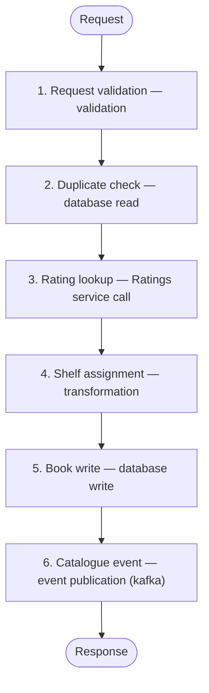

# API: Book registration

Endpoint: `POST /books`

A librarian registers a new book in the catalogue. The service validates the
data, looks up the community rating, and assigns the book to a shelf.

## Input data (request)

```json
{
  "book": {
    "title": "A Study in Synthetic Data",
    "isbn": "9780000000001",
    "genre": "CRIME"
  },
  "loan": {
    "copies": 3,
    "periodDays": 14,
    "availableFrom": "2026-09-01"
  }
}
```

Notes: availableFrom is optional — without it the book is available from today.

## Flow



- [1. Request validation — validation](parts/step-01-validation.md)
- [2. Duplicate check — database read](parts/step-02-db-read.md)
- [3. Rating lookup — Ratings service call](parts/step-03-external-call.md)
- [4. Shelf assignment — transformation](parts/step-04-transformation.md)
- [5. Book write — database write](parts/step-05-db-write.md)
- [6. Catalogue event — event publication (kafka)](parts/step-06-kafka-event.md)

## Responses

### Happy path — HTTP 201

Book registered, shelf assigned.

```json
{
  "bookId": "BK-2026-000431",
  "status": "REGISTERED",
  "shelf": {
    "room": "A",
    "row": 12
  }
}
```

### Error — HTTP 400

The data failed validation.

```json
{
  "code": "VAL-002",
  "field": "book.isbn"
}
```

### Error — HTTP 409

A book with this ISBN is already in the catalogue.

```json
{
  "code": "BOK-409"
}
```

## Open questions

| Concerns | Step | Status | Comment |
|---|---|---|---|
| Behaviour when ratings are unavailable | 3. Rating lookup — Ratings service call | To decide | Is an unrated book acceptable, or should registration wait? |
| Shelf overflow | 4. Shelf assignment — transformation | To fill in | No rule for a full shelf — to confirm with the librarians. |
| Copies limit per title | Whole design | Waiting for input | Waiting for the lending policy — today only a duplicate ISBN is blocked. |
