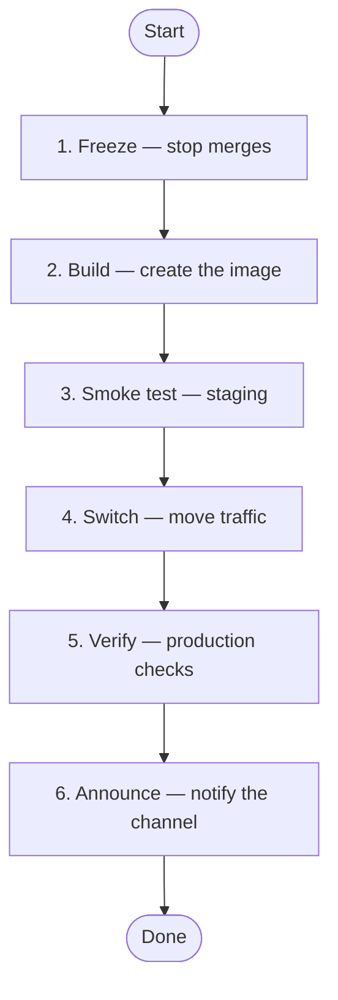

# Runbook: Deploy the catalogue service

Owner: platform team

A release goes out once the change set is approved. The steps below are run
in order; each one has a rollback.

## Before you start

```json
{
  "release": "2026.08.1",
  "environment": "staging",
  "approvals": ["qa", "owner"]
}
```

Notes: the environment defaults to staging when it is left out.

## Flow



- [1. Freeze — stop merges](steps/step-01-freeze.md)
- [2. Build — create the image](steps/step-02-build.md)
- [3. Smoke test — staging](steps/step-03-smoke-test.md)
- [4. Switch — move traffic](steps/step-04-switch.md)
- [5. Verify — production checks](steps/step-05-verify.md)
- [6. Announce — notify the channel](steps/step-06-announce.md)

## Rollback

### Switch back

Point traffic at the previous image; it stays available for a week.

```json
{
  "release": "2026.07.3",
  "environment": "production"
}
```

### Failed smoke test

Fix forward on staging. Nothing reached production.

## Open questions

| Concerns | Step | Status | Comment |
|---|---|---|---|
| Who approves at night | 4. Switch — move traffic | To decide | Is one approval enough outside office hours? |
| Image retention | Whole runbook | Waiting for input | How long are old images kept? |
